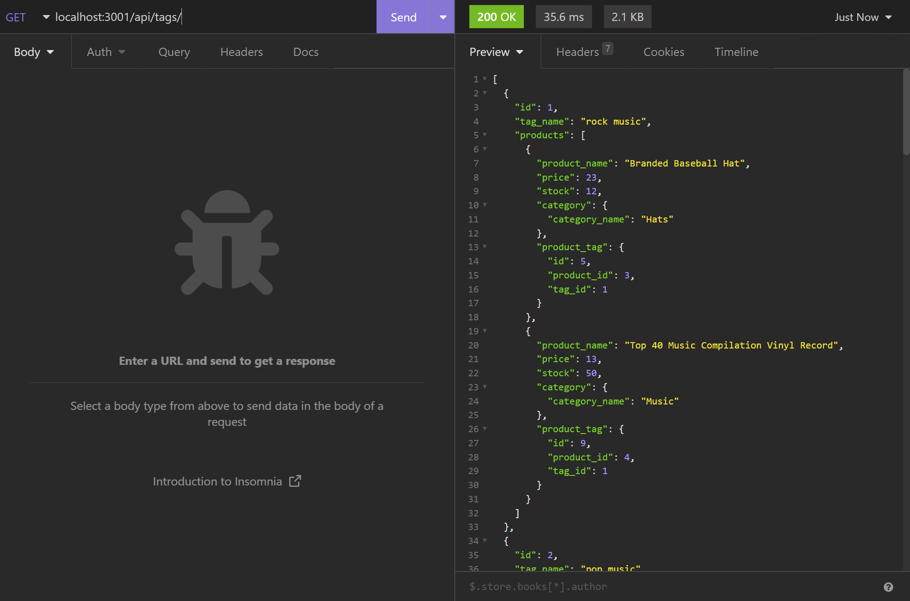

# E-Commerce Database

## Description

A series of API endpoints designed for use with an e-commerce application.

## Table of Contents
- [Installation](#installation)
- [Usage](#usage)
- [Images](#images)

- [Credits](#credits)

- [License](#license)

## Installation

Navigate to the repository's root directory and run 'npm i' to acquire the modules necessary to run the node server.

## Usage

This application requires a MySQL database in order to run; use the included schema.sql file to create this database. Once this has been done, seeds can be added to test the api endpoints. Run 'node seeds/index.js' in order to seed the database; the application can be started using 'npm start' in the commandline, and the api endpoints can be tested in a browser or similar testing environment.

Please make sure the included .env.example file is edited to include the information necessary for the application to access your database, and that it is renamed to simply .env

A video walkthrough can be found [at this link.](https://www.youtube.com/watch?v=7tK51AMAWIc)

## Images

## Credits

Created by [Daniel Brackenbury](https://github.com/helpvisa).

## License

Copyright 2022 Daniel Brackenbury

Permission is hereby granted, free of charge, to any person obtaining a copy of this software and associated documentation files (the "Software"), to deal in the Software without restriction, including without limitation the rights to use, copy, modify, merge, publish, distribute, sublicense, and/or sell copies of the Software, and to permit persons to whom the Software is furnished to do so, subject to the following conditions:

The above copyright notice and this permission notice shall be included in all copies or substantial portions of the Software.

THE SOFTWARE IS PROVIDED "AS IS", WITHOUT WARRANTY OF ANY KIND, EXPRESS OR IMPLIED, INCLUDING BUT NOT LIMITED TO THE WARRANTIES OF MERCHANTABILITY, FITNESS FOR A PARTICULAR PURPOSE AND NONINFRINGEMENT. IN NO EVENT SHALL THE AUTHORS OR COPYRIGHT HOLDERS BE LIABLE FOR ANY CLAIM, DAMAGES OR OTHER LIABILITY, WHETHER IN AN ACTION OF CONTRACT, TORT OR OTHERWISE, ARISING FROM, OUT OF OR IN CONNECTION WITH THE SOFTWARE OR THE USE OR OTHER DEALINGS IN THE SOFTWARE.
